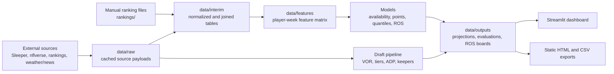

# Fantasy Football Decision Support

A league-aware fantasy football analytics platform for draft preparation, weekly lineup decisions, rest-of-season rankings, and model evaluation. The project combines Sleeper league data, nflverse history, several projection and ranking sources, custom scoring, machine-learning models, Monte Carlo simulation, and a multipage Streamlit dashboard.

The application is designed for a personal, data-driven workflow: expensive ingestion and modeling happen ahead of time, outputs retain provenance, and the dashboard reads precomputed artifacts so it stays fast on draft day and during the season.

> **Project status:** active personal project, version `0.1.0`. The checked-in configuration currently targets the 2026 season and uses **Rogan Radinator League** as the primary league. Generated data is mostly local and is not included in Git, so a fresh clone needs to build or restore its data artifacts before every dashboard page is available.

## Table of contents

- [What it does](#what-it-does)
- [How the system fits together](#how-the-system-fits-together)
- [Requirements](#requirements)
- [Quick start](#quick-start)
- [Configuration](#configuration)
- [Common workflows](#common-workflows)
- [Command reference](#command-reference)
- [Dashboard pages](#dashboard-pages)
- [Data and output layout](#data-and-output-layout)
- [Models and methodology](#models-and-methodology)
- [Repository layout](#repository-layout)
- [Development and testing](#development-and-testing)
- [Troubleshooting](#troubleshooting)
- [Security, privacy, and reproducibility](#security-privacy-and-reproducibility)
- [Known limitations](#known-limitations)
- [License](#license)

## What it does

### Draft preparation

- Builds a league-scoring-aware draft board from multiple projection and ranking sources.
- Calculates value over replacement (VOR), positional rank, tiers, projected points per game, dispersion, ADP value, probability of surviving to the next pick, and opportunity cost.
- Supports manually curated keepers and league-specific pick order.
- Generates a self-contained offline HTML draft board plus a CSV fallback.
- Provides desktop, mobile, live-pick, replay, and mock-draft experiences.
- Keeps pure source rankings available alongside the modeled board for comparison.

### Weekly and rest-of-season decisions

- Produces weekly player projections with availability probabilities and configurable quantiles.
- Produces multiweek rest-of-season projections and free-agent VOR rankings.
- Shows positional strength of schedule, a schedule heatmap, and player matchup details.
- Contains reusable simulation and decision modules for lineups, start/sit choices, trades, waivers, weekly outcomes, season outcomes, injuries, and score persistence.

### Data quality and evaluation

- Resolves player identities across Sleeper, nflverse, and ranking providers.
- Scores historical stat lines using each league's actual scoring settings.
- Validates scoring results against Sleeper's historical player points.
- Enforces feature lag and live-inference availability to guard against leakage.
- Runs walk-forward evaluation rather than a random train/test split.
- Preserves timestamped predictions, reports, model metadata, feature hashes, and Git commit provenance.
- Logs perishable in-season consensus projections so they can be evaluated after games are played.

### Offline-first operation

The default configuration sets `FFAPP_OFFLINE=1`. Reads use the local cache unless a command is explicitly run with `--no-offline`. Cache entries have source-specific freshness limits, and strict mode can turn stale data into an error rather than a warning.

## How the system fits together



The main layers are deliberately separated:

1. **Ingest** fetches and normalizes source-specific data without embedding decision logic.
2. **Interim builders** join sources and calculate canonical football tables.
3. **Feature builders** create point-in-time-safe model inputs.
4. **Models and simulations** generate distributions, projections, and decision metrics.
5. **Tools and draft modules** convert projections into rankings and recommendations.
6. **CLI commands** materialize artifacts; **Streamlit pages** read those artifacts.

## Requirements

- Python 3.11 or newer. Python 3.11 is the safest choice for binary packages such as NumPy and LightGBM.
- [uv](https://docs.astral.sh/uv/) for environment and dependency management.
- Git, used both for normal development and for provenance recorded in generated artifacts.
- Internet access for initial cache warming and any command run with `--no-offline`.
- A Sleeper account for league discovery and roster-aware features.
- Windows for the included `.bat` shortcuts. The underlying `uv` and Streamlit commands are cross-platform.

Optional credentials:

- `ANTHROPIC_API_KEY` enables the structured news pipeline.
- `ODDS_API_KEY` is reserved for odds-provider integrations.

## Quick start

### 1. Clone and install

```powershell
git clone https://github.com/Jqkeyyy/fantasyfootball.git
cd fantasyfootball
uv python install 3.11
uv sync --dev --python 3.11
```

`uv sync` installs the application, the `ffapp` console command, runtime dependencies, and development tools from `pyproject.toml` and `uv.lock`.

### 2. Create the environment file

On PowerShell:

```powershell
Copy-Item .env.example .env
```

On macOS or Linux:

```bash
cp .env.example .env
```

The default file is intentionally offline-first:

```dotenv
FFAPP_OFFLINE=1
FFAPP_CACHE_STRICT=1
ODDS_API_KEY=
ANTHROPIC_API_KEY=
```

Set your Sleeper username in `config/settings.yml`:

```yaml
sleeper:
  username: "your-sleeper-username"
```

### 3. Discover and select a league

League discovery must use the live network:

```powershell
uv run ffapp ingest sleeper --season 2026 --discover --no-offline
```

This writes one file per league under `config/leagues/`. Open the desired league file and set:

```yaml
is_primary: true
```

Exactly one league must be primary. Commands that accept `--league` use that primary league when the option is omitted.

### 4. Warm the Sleeper cache

```powershell
uv run ffapp cache warm --season 2026 --all-leagues --no-offline
uv run ffapp cache status
```

### 5. Prepare a draft board

Place any supported manually exported ranking workbooks in `rankings/`, then run:

```powershell
uv run ffapp ingest rankings --league rogan-radinator-league --no-offline
uv run ffapp draft board --league rogan-radinator-league
```

On Windows, `draft-prep.bat` performs those two commands for the currently hardcoded `rogan-radinator-league` league.

### 6. Launch the dashboard

```powershell
uv run streamlit run src/ffapp/app/streamlit_app.py
```

Then open `http://localhost:8501`.

Windows users can instead double-click `start-app.bat`. It starts Streamlit on localhost only, opens a browser, and creates an empty Streamlit credentials file on first use to bypass Streamlit's interactive welcome prompt.

## Configuration

### Global settings

`config/settings.yml` controls repository-wide behavior:

| Section | Purpose |
| --- | --- |
| `paths` | Root directory for raw, interim, feature, and output data. |
| `seasons` | Historical training start and current NFL season. |
| `sleeper` | Sleeper username used to resolve the owner's roster. |
| `model` | Positions, output quantiles, minimum training rows, retraining cadence, live projection source, and LightGBM parameters. |
| `simulation` | Weekly/season simulation counts and football correlation assumptions. |
| `draft` | Tier method, ADP uncertainty fallback, excluded positions, and replacement-rank adjustments. |
| `waivers` | Playoff weighting and FAAB aggressiveness. |
| `cache` | Cache root, default network mode, source freshness windows, and stale-data warning behavior. |

The current live mean projection source is `consensus_b3`. Supported values are:

- `consensus_b3` — historical/live FantasyPros consensus baseline and the current shipped default.
- `baseline_b2` — four-week exponentially weighted historical baseline.
- `anchored` — residual model anchored to B2.
- `direct` — direct learned points model.

The configured draft board excludes kickers and team defenses by default because the current strategy streams those positions.

### League files

Each `config/leagues/<slug>.yml` file contains:

- The display name and stable slug.
- Whether it is the primary league.
- Sleeper league ID and season.
- A cached roster shape and scoring configuration.
- Waiver settings and playoff start week.
- Flex and superflex eligibility overrides.

Use `--league <slug>` whenever you do not want the primary league.

### Keepers

Keeper corrections live in files named like:

```text
config/keepers_<league-slug>_<season>.yml
```

Each keeper has an owner, player name, and pick in `round.pick-within-round` notation. These files are intentionally hand-curated because upstream keeper metadata may not match the league's actual rules.

### Identity overrides

`config/id_overrides.csv` handles player identities that cannot be matched reliably across sources. After refreshing source data, run the ID gate:

```powershell
uv run ffapp ids check --season 2026 --top-n 300
```

### ROS calibration and source evaluation

- `config/ros_calibration.yml` stores empirically estimated week-to-week correlation and injury recovery rates by position.
- `config/projection_source_evaluation.yml` is the human-curated summary displayed on the Model Health page.
- `config/source_refresh_status.yml` records whether projection sources behave as weekly, frozen, or season-long feeds.

## Common workflows

### Draft-day workflow

Run this on the morning of the draft while online:

```powershell
uv run ffapp ingest rankings --league rogan-radinator-league --no-offline
uv run ffapp draft board --league rogan-radinator-league
uv run ffapp draft export --league rogan-radinator-league
uv run streamlit run src/ffapp/app/streamlit_app.py
```

The first command refreshes every available point-projection source, rank source, and ADP cache. Individual source failures degrade gracefully, but the board cannot be built if all point sources fail.

For an offline phone backup:

```powershell
uv run ffapp draft export --league rogan-radinator-league --out draft-board.html
```

The HTML contains its scripts and board data inline and does not require a CDN, external font, or network request. A CSV is written beside it.

To rehearse the live UI with a prior completed Sleeper draft:

```powershell
uv run ffapp draft live --league rogan-radinator-league --replay --pace-seconds 8
```

Open the Draft Mobile page, then clear the replay when finished:

```powershell
uv run ffapp draft live --league rogan-radinator-league --stop
```

### Weekly projection workflow

Once the current week's feature rows exist:

```powershell
uv run ffapp project --week 6 --season 2026 --league rogan-radinator-league --no-offline
```

The command fits only on rows earlier than the target week and upserts results into `data/outputs/projections.parquet`. The output includes point estimates, availability, quantiles, model version, projection source, timestamp, feature hash, and Git commit.

The default `consensus_b3` path also requires:

- `data/interim/b3_predictions.parquet`;
- a current player-ID crosswalk;
- a cached or live FantasyPros weekly archive snapshot.

### Rest-of-season workflow

The `project` command still requires `--week` in range mode, although that single-week value is ignored when both range options are present:

```powershell
uv run ffapp project --week 6 --from-week 6 --through-week 18 --season 2026 --league rogan-radinator-league --no-offline
uv run ffapp rankings ros --season 2026 --league rogan-radinator-league --no-offline
```

The first command writes `data/outputs/<league>/projections_ros.parquet`. The second restricts results to the current free-agent pool, applies availability and injury modeling, computes ROS VOR, retains a timestamped board, updates `latest.parquet`, and reports rank movement since the prior run.

### Model evaluation workflow

```powershell
uv run ffapp evaluate --seasons 2021 2022 2023 2024 2025
```

Each run gets its own timestamped directory beneath `data/outputs/eval/`, containing:

- `predictions.parquet` for points-model and baseline predictions;
- `availability_predictions.parquet` for availability-model predictions;
- `report.md` with accuracy, ranking, lineup-regret, calibration, and feature-importance results.

The Model Health dashboard page displays the newest report by default and keeps older runs selectable.

### In-season prediction logging

Weekly projections are perishable. Capture them at defined checkpoints:

```powershell
uv run ffapp log week --week 6 --run-label tuesday --season 2026 --league rogan-radinator-league --no-offline
uv run ffapp log week --week 6 --run-label thursday --season 2026 --league rogan-radinator-league --no-offline
uv run ffapp log week --week 6 --run-label sunday --season 2026 --league rogan-radinator-league --no-offline
```

After the games are represented in the feature table:

```powershell
uv run ffapp log backfill --week 6 --season 2026 --league rogan-radinator-league
```

After roughly three or four logged weeks, inspect source behavior:

```powershell
uv run ffapp log check-sources --league rogan-radinator-league
```

Prediction logs are the deliberate exception to the general `data/` ignore rule. Commit them because a past week's live consensus data generally cannot be reconstructed later.

### Historical materialization

`notebooks/materialize_b3_historical.py` is a production materializer despite its location. It retrieves the historical FantasyPros weekly archive and builds the B3 files needed by the default projection path:

```powershell
uv run python notebooks/materialize_b3_historical.py
```

The archive uses unauthenticated GitHub requests and may hit the 60-request-per-hour limit. Fetches are cached individually, so rerunning later resumes without refetching completed snapshots.

Re-estimate committed ROS correlation and recovery constants after another season of historical data is available:

```powershell
uv run python notebooks/estimate_ros_calibration.py
```

The remaining scripts in `notebooks/` are model experiments and evaluation utilities; inspect their module docstrings and constants before running them.

## Command reference

All commands support standard Typer help:

```powershell
uv run ffapp --help
uv run ffapp <group> --help
uv run ffapp <group> <command> --help
```

| Command | Purpose | Important options |
| --- | --- | --- |
| `ffapp --version` | Print the installed version. | — |
| `ffapp ingest sleeper` | Discover Sleeper leagues and write/update league stubs. | Required: `--season`, `--discover`; use `--no-offline`. |
| `ffapp ingest rankings` | Refresh projection, rank, and ADP caches. | `--league`, `--season`, `--offline/--no-offline`. |
| `ffapp cache warm` | Fetch and archive Sleeper data for all leagues. | Required: `--season`, `--all-leagues`; use `--no-offline`. |
| `ffapp cache status` | Print every cached artifact, age, and freshness verdict. | — |
| `ffapp cache verify` | Verify that cached data can satisfy a named internal task. | Required: `--for-task`, for example `0.7`. |
| `ffapp ids check` | Report unresolved cross-source player identities and fail on important misses. | Required: `--season`; optional `--top-n` (default `300`). |
| `ffapp scoring validate` | Compare locally computed scoring with Sleeper's played-season points. | `--league` or `--all-leagues`, network override. |
| `ffapp draft board` | Build modeled and source-only draft board CSVs. | `--league`, `--season`, network override. |
| `ffapp draft export` | Build a self-contained HTML board and adjacent CSV. | `--league`, `--season`, `--out`, network override. |
| `ffapp draft live` | Start/stop a timed replay of a completed real draft. | `--replay`, `--pace-seconds`, `--stop`, `--league`. |
| `ffapp evaluate` | Run walk-forward points and availability evaluation. | Required multi-value `--seasons`. |
| `ffapp project` | Generate a weekly projection or a ROS week range. | Required `--week`; optional `--season`, `--league`, `--from-week`, `--through-week`, network override. |
| `ffapp rankings ros` | Build a current-free-agent ROS ranking board. | `--league`, `--season`, network override. |
| `ffapp log week` | Preserve a real pregame projection snapshot. | Required `--week`, `--run-label`; optional `--season`, `--league`, network override. |
| `ffapp log backfill` | Add actual points to a logged week. | Required `--week`; optional `--season`, `--league`. |
| `ffapp log check-sources` | Classify logged source refresh behavior and update its config summary. | `--league`. |

When a command offers `--offline/--no-offline`, omitting both uses the `FFAPP_OFFLINE` environment setting.

## Dashboard pages

The Streamlit entry point is `src/ffapp/app/streamlit_app.py`. Its pages do not train models; they load the files listed below.

| Page | What it shows | Required artifact(s) |
| --- | --- | --- |
| **Draft Board** | Filters, tier breaks, VOR, ADP value, and opportunity cost. Includes Pure Rankings and Live Draft tabs. | `data/outputs/draft_board_<season>.csv`; source tab also uses `source_rankings_<season>.csv`. |
| **Weekly Rankings** | Position tabs, week selection, roster/free-agent context, and weekly projections. | `data/outputs/projections.parquet` plus cached player/roster identity data. |
| **Schedule Grid** | Positional SOS, bye-aware heatmap, and player matchup detail with usage context. | `data/interim/schedule.parquet`, `defense_position_allowed.parquet`, and `data/features/player_week_features.parquet`. |
| **Model Health** | Active projection source and current/historical evaluation reports. | `config/projection_source_evaluation.yml` and `data/outputs/eval/*/report.md`. |
| **Draft Mobile** | Phone-friendly best-available cards, position filters, tier depth, and live/replayed picks. | Draft board CSV plus live Sleeper access or an active replay session. |
| **Mock Draft** | Sleeper-style draft grid and repeated practice against ADP-driven bots using real keepers and pick order. | Draft board CSV, league config, and keeper config where applicable. |
| **ROS Rankings** | Current free-agent ROS rank, movement, expected games, quantile totals, VOR, and playoff value. | `data/outputs/<league>/rankings_ros/latest.parquet`. |

Streamlit discovers numbered files in `src/ffapp/app/pages/` automatically. Internal `*_page.py` modules contain testable transformation and rendering helpers; numbered files contain the Streamlit UI glue.

## Data and output layout

```text
data/
├── raw/                         # cached source responses and sidecar metadata
│   ├── nflverse/
│   ├── rankings/
│   └── sleeper/
├── interim/                     # normalized and joined football tables
│   ├── schedule.parquet
│   ├── defense_position_allowed.parquet
│   ├── fp_weekly_consensus.parquet
│   └── b3_predictions.parquet
├── features/
│   └── player_week_features.parquet
└── outputs/
    ├── draft_board_<season>.csv
    ├── source_rankings_<season>.csv
    ├── draft_board_<season>_export.html
    ├── projections.parquet
    ├── eval/<timestamp>/
    │   ├── predictions.parquet
    │   ├── availability_predictions.parquet
    │   └── report.md
    └── <league>/
        ├── projections_ros.parquet
        ├── rankings_ros/
        │   ├── latest.parquet
        │   └── <timestamp>/board.parquet
        └── prediction_log/
            ├── latest.parquet
            ├── source_fetches.parquet
            └── season=<season>/week=<week>.parquet
```

Exact files appear only after the workflow that produces them has run. Nearly all `data/` contents are ignored because they can be large, machine-local, or regenerated. Prediction logs are tracked because their source values are time-sensitive.

Manual source files in `rankings/` are also ignored. Keep licensed or account-specific exports local; the draft pipeline normalizes them without publishing the originals.

## Models and methodology

### Point-in-time safety

The feature registry describes every model feature's lag and whether it is available at inference time. The build layer raises on a feature that can see the target week's outcome or a training-only feature used for a live prediction. Training and evaluation use chronological cutoffs.

### Projection composition

A final weekly distribution combines:

- A conditional mean from the configured projection source.
- A separately modeled probability that the player is active.
- Quantile estimates for uncertainty-aware decisions.
- Metadata identifying the model, source data state, code revision, and build time.

The live default is consensus B3 because its recorded evaluation outperformed the B2 baseline on lineup regret. The direct and anchored models remain available for experiments and comparison.

### Draft valuation

The draft board rescales point-based sources through the real league scoring system, maps rank-only sources onto the point scale, aggregates sources, adjusts for expected games, and derives replacement levels from the league's roster structure. Tiers identify projection gaps; ADP uncertainty estimates whether a player will remain available and the opportunity cost of waiting.

### Evaluation

`ffapp evaluate` walks forward one week at a time, fitting only on prior data. It evaluates B0 positional means, B1 season-to-date means, B2 four-week exponentially weighted means, the LightGBM points model, and a separate availability model. Reports include accuracy, within-position ranking, start/sit behavior, lineup regret, Brier scores, calibration, confidence intervals, and feature importance where data permits.

### Simulation primitives

The `ffapp.sim` package includes lineup optimization, correlated weekly sampling, season simulation, injury-duration modeling, week-to-week persistence, start/sit comparison, and trade analysis. Correlations are configured for QB/pass-catcher stacks, same-team RBs, and players facing an opposing DST. These are reusable Python APIs; not every simulation primitive currently has a top-level CLI command or dashboard page.

## Repository layout

```text
fantasyfootball/
├── config/                    # global, league, keeper, calibration, and override config
├── data/                      # local raw/interim/features/output artifacts
├── notebooks/                 # production materializers and research/evaluation scripts
├── rankings/                  # local manual ranking and ADP exports
├── src/ffapp/
│   ├── app/                   # Streamlit pages and testable view helpers
│   ├── cache/                 # offline cache policy and registry
│   ├── draft/                 # board, export, live, replay, mock, keepers, pick order
│   ├── evaluation/            # walk-forward harness, metrics, reports, snapshots
│   ├── features/              # point-in-time-safe feature engineering
│   ├── ids/                   # player crosswalk and override handling
│   ├── ingest/                # external-source clients and normalization
│   ├── interim/               # canonical joined tables
│   ├── models/                # baselines, points, availability, quantiles, ROS
│   ├── projections/           # projection aggregation and games-played adjustment
│   ├── scoring/               # league scoring engine and validation
│   ├── sim/                   # week, season, lineup, injury, trade, start/sit simulation
│   ├── tools/                 # VOR, tiers, ADP, SOS, waivers, ROS, prediction logs
│   ├── cli.py                 # Typer command tree
│   └── config.py              # typed settings and path loading
├── tests/                     # unit and CLI tests; network calls are mocked
├── draft-prep.bat             # Windows draft-day refresh shortcut
├── start-app.bat              # Windows localhost Streamlit launcher
├── pyproject.toml             # package metadata and tool configuration
└── uv.lock                    # reproducible dependency lockfile
```

## Development and testing

Install the development dependencies, then run:

```powershell
uv run pytest
uv run ruff check .
uv run mypy
```

Useful focused examples:

```powershell
uv run pytest tests/test_cli.py
uv run pytest tests/test_draft_board.py tests/test_draft_live.py
uv run pytest tests/test_models_predict.py tests/test_leakage.py
uv run pytest tests/test_app_weekly_rankings_page.py
```

The project settings enforce:

- Python 3.11-compatible syntax.
- Ruff rules `E`, `F`, `I`, `UP`, and `B` with a 100-character line limit.
- Strict mypy checking across `src/`.
- Pytest discovery under `tests/`.

Tests must not rely on a live network. Ingestion tests mock external services, while offline/cache tests assert the expected missing and stale-data behavior.

When contributing:

1. Preserve the separation between ingestion, business logic, and UI glue.
2. Keep ingestion idempotent and retain provenance on generated outputs.
3. Add or update tests for behavior changes.
4. Treat all feature timing changes as leakage-sensitive.
5. Avoid committing raw provider data, secrets, virtual environments, or licensed ranking exports.

## Troubleshooting

### `ffapp` is not recognized

Run through uv so the project environment and editable package are active:

```powershell
uv sync --dev --python 3.11
uv run ffapp --help
```

### A command reports an offline cache miss

The repository defaults to offline mode. Refresh the required source explicitly:

```powershell
uv run ffapp cache warm --season 2026 --all-leagues --no-offline
uv run ffapp ingest rankings --season 2026 --no-offline
```

Then inspect the cache:

```powershell
uv run ffapp cache status
```

### A stale cache raises instead of warning

`FFAPP_CACHE_STRICT=1` promotes stale entries to errors. Refresh online, or set it to `0` for warning-only behavior when stale data is acceptable for the task.

### No primary league is configured

Set `is_primary: true` on exactly one file in `config/leagues/`. All others must be `false`.

### The dashboard says an artifact is missing

Dashboard pages do not build data on demand. Run the producer named in the page's error message:

- Draft page: `ffapp draft board`
- Weekly Rankings: `ffapp project --week N`
- Model Health: `ffapp evaluate --seasons ...`
- ROS Rankings: range-mode `ffapp project`, followed by `ffapp rankings ros`
- Schedule Grid: materialize the interim schedule, defense-vs-position, and feature tables

### The B3 file is missing

Run:

```powershell
uv run python notebooks/materialize_b3_historical.py
```

The script needs an existing interim schedule and live access for uncached archive snapshots.

### NumPy, SciPy, or LightGBM fails to import on Windows

Recreate the environment with a supported Python version instead of reusing a mismatched virtual environment:

```powershell
Remove-Item -Recurse -Force .venv
uv python install 3.11
uv sync --dev --python 3.11
```

Only remove `.venv` after confirming it is the project-local virtual environment and that it contains no hand-created files.

### Port 8501 is already in use

Stop the existing Streamlit process or use another port:

```powershell
uv run streamlit run src/ffapp/app/streamlit_app.py --server.port 8502
```

### Live draft data does not update

Confirm the league file has the current Sleeper league ID and season. The desktop live tab refreshes on demand. The mobile page can read a replay session created by `ffapp draft live --replay`; run `ffapp draft live --stop` if an old replay is still active.

### Player IDs do not resolve

Run `ffapp ids check`, inspect the unmatched players, and add only verified corrections to `config/id_overrides.csv`. Do not guess identity mappings; incorrect joins silently contaminate projections and historical evaluation.

## Security, privacy, and reproducibility

- `.env` is ignored. Never commit API keys or tokens.
- Raw caches, generated artifacts, ranking workbooks, virtual environments, and local project notes are ignored.
- The Streamlit Windows launcher binds to `localhost`, not the LAN.
- League files contain Sleeper league IDs, roster rules, and scoring details. Review them before publishing a fork.
- Ranking exports may be licensed or tied to paid accounts; keep them in the ignored `rankings/` directory.
- Prediction logs are intentionally tracked. Review their contents before committing if the repository is public.
- Generated model outputs store their timestamp and Git revision where supported, making results easier to trace to source code.

## Known limitations

- A fresh clone does not contain the large raw, interim, feature, ranking, or most output artifacts needed for every page.
- There is not yet one public CLI command that performs the entire historical raw-to-feature build; some materialization is orchestrated through Python modules and scripts.
- Current feature generation focuses on QB, RB, WR, and TE. Draft/scoring support also understands K and DST, but the configured draft board excludes them.
- Route participation and some proprietary charting metrics are unavailable from the chosen public sources.
- Some team-context fields remain null when a reliable public source or validated method is unavailable; the project prefers missing values to fabricated precision.
- The default B3 history starts with the available FantasyPros weekly archive in 2021.
- Live dashboard pages depend on locally precomputed data and, where noted, a current Sleeper cache or network connection.
- Simulation correlations and some waiver constants are configured assumptions and should be recalibrated as more league history becomes available.

## License

No license file is currently included. Unless the repository owner adds one, the source is available for viewing but no broader permission to copy, modify, or redistribute it is granted.
